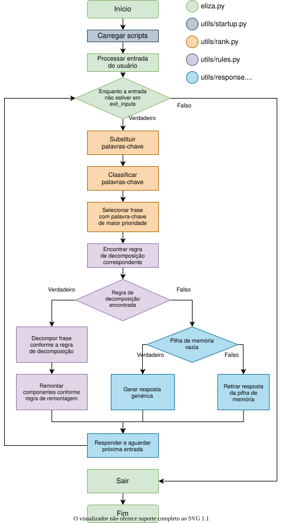

# ELIZA-PY, Português Brasileiro (PT-BR)

Implementação da **ELIZA** adaptada para conversação em **português brasileiro (PT-BR)**, baseada no projeto [`eliza-py`](https://github.com/rdimaio/eliza-py) e no clássico script **DOCTOR**, inspirado no trabalho de Joseph Weizenbaum.

Esta adaptação preserva a arquitetura determinística da ELIZA, baseada em **palavras-chave**, **ranking**, **regras de decomposição**, **regras de remontagem** e **memória**, sem utilizar aprendizado de máquina, modelos de linguagem ou serviços externos.

A tradução dos arquivos linguísticos não foi realizada de forma literal. As regras foram revisadas e adaptadas para produzir respostas com melhor coerência **semântica, sintática e lexical** em português brasileiro.

---

## Origem do projeto e créditos

Este projeto é um **fork e uma adaptação para Português Brasileiro (PT-BR)** do projeto original **[`eliza-py`](https://github.com/rdimaio/eliza-py)**, desenvolvido por **[rdimaio](https://github.com/rdimaio)**.

O projeto original fornece a implementação em Python da ELIZA, incluindo o mecanismo de processamento por regras, o script DOCTOR e a estrutura dos arquivos JSON utilizados pelo programa.

Esta versão mantém essa base e acrescenta modificações específicas para permitir uma interação mais natural em português brasileiro, incluindo:

- tradução e adaptação das palavras-chave e respostas do script DOCTOR;
- normalização lexical e ortográfica de entradas em PT-BR;
- tratamento de pronomes, possessivos e reflexões linguísticas;
- suporte a palavras-chave e substituições compostas;
- ajustes no motor para particularidades gramaticais do português;
- suporte explícito a UTF-8;
- testes direcionados à conversação em português brasileiro.

> **Projeto original:** [github.com/rdimaio/eliza-py](https://github.com/rdimaio/eliza-py)  
> **Autor do projeto original:** [rdimaio](https://github.com/rdimaio)

---

## Sobre a ELIZA

A **ELIZA** foi desenvolvida por Joseph Weizenbaum entre 1964 e 1966 e é um dos programas mais conhecidos da história da Inteligência Artificial e do Processamento de Linguagem Natural.

Seu script mais famoso, **DOCTOR**, simula uma conversação inspirada em um psicoterapeuta rogeriano. Apesar da aparência de diálogo, a ELIZA não realiza compreensão semântica no sentido moderno: sua operação é baseada principalmente na identificação de padrões textuais e na aplicação de regras predefinidas.

Este projeto preserva essa característica histórica.

---

## Fluxo de funcionamento

O fluxograma abaixo apresenta, de forma simplificada, o processamento realizado pelo ELIZA-PY desde a entrada do usuário até a geração da resposta.



De forma geral, o programa:

1. recebe e normaliza a entrada do usuário;
2. identifica e classifica palavras-chave;
3. seleciona a palavra-chave de maior prioridade;
4. procura uma regra de decomposição correspondente;
5. decompõe a frase em componentes;
6. aplica reflexões linguísticas quando necessário;
7. seleciona uma regra de remontagem;
8. gera a resposta;
9. utiliza a pilha de memória ou uma resposta genérica quando nenhuma regra adequada é encontrada;
10. aguarda a próxima entrada do usuário.

---

## Requisitos

- **Python 3.x**
- Nenhuma biblioteca externa é necessária.

---

## Executando o programa

No diretório raiz do projeto, execute:

```bash
python eliza.py
```

Exemplo de interação:

```text
Eliza: Olá. Conte-me o que está acontecendo.
Você: Eu estou triste
Eliza: Sinto muito que você esteja se sentindo triste.

Você: Eu quero ajuda
Eliza: O que significaria para você conseguir ajuda?
```

### Encerrando a conversa

Para finalizar uma sessão, podem ser utilizadas expressões como:

```text
tchau
adeus
sair
fim
terminar
encerrar
até logo
```

### Reiniciando a sessão

Para reiniciar o ciclo das respostas e limpar a memória durante a execução:

```text
reiniciar
reset
```

---

## Arquivos linguísticos

A maior parte do comportamento conversacional da ELIZA é definida nos arquivos JSON localizados em `scripts/`.

### `scripts/general.json`

Contém informações linguísticas gerais utilizadas pelo motor.

Principais campos:

- **`substitutions`**, realiza normalização lexical e ortográfica da entrada, incluindo formas como:
  - `vc → você`
  - `tô → estou`
  - `ta → está`
  - `nao → não`

  Também pode normalizar sinônimos, abreviações e saudações.

- **`reflections`**, realiza mudanças de perspectiva nos componentes utilizados para construir a resposta, por exemplo:
  - `eu → você`
  - `meu → seu`
  - `minha → sua`

- **`tags`**, agrupa palavras pertencentes a campos semânticos relacionados, como:
  - família;
  - desejo;
  - crença;
  - felicidade;
  - tristeza.

- **`memory_inputs`**, define palavras ou construções que podem alimentar a pilha de memória.

- **`exit_inputs`**, define expressões utilizadas para encerrar a conversa.

### `scripts/doctor.json`

Contém o script **DOCTOR** adaptado para português brasileiro.

O arquivo define:

- palavras-chave;
- ranking das palavras-chave;
- regras de decomposição;
- regras de remontagem;
- respostas associadas às regras;
- regras especiais relacionadas à memória e às respostas genéricas.

Duas palavras-chave especiais são utilizadas pelo mecanismo:

- **`^`**, permite recuperar uma resposta da pilha de memória;
- **`$`**, permite selecionar uma resposta genérica.

---

## Adaptações do motor para Português Brasileiro

Uma simples tradução do inglês para o português não é suficiente para manter o funcionamento adequado da ELIZA.

No inglês, reflexões relativamente simples como `I ↔ you` e `am ↔ are` funcionam em diversos contextos. Em português, a flexão verbal, o gênero, os possessivos e as mudanças de pessoa exigem tratamento adicional.

Por esse motivo, esta versão introduz algumas adaptações no motor original.

### 1. Separação entre normalização e reflexão

A normalização da entrada e a mudança de perspectiva são tratadas como operações diferentes.

A entrada é normalizada antes da identificação das regras, enquanto as reflexões são aplicadas apenas aos componentes que serão utilizados na construção da resposta.

Isso reduz transformações gramaticalmente incorretas.

### 2. Palavras-chave compostas

O motor reconhece expressões formadas por mais de uma palavra, permitindo que construções como:

```text
por que
o que
```

tenham regras e prioridades próprias.

### 3. Substituições de expressões completas

Também são suportadas substituições que envolvem mais de um termo, por exemplo:

```text
boa noite → olá
com você → comigo
```

Esse recurso é particularmente importante para manter a naturalidade das reflexões em português.

### 4. Reflexões verbais conservadoras

As transformações verbais são realizadas de forma conservadora.

Formas inequivocamente associadas à primeira pessoa podem ser convertidas quando necessário, mas formas potencialmente ambíguas não são modificadas de maneira indiscriminada.

Essa estratégia evita erros causados por palavras que podem desempenhar funções gramaticais diferentes dependendo do contexto.

### 5. Suporte explícito a UTF-8

Os arquivos JSON são abertos explicitamente utilizando **UTF-8**, garantindo o funcionamento correto de caracteres como:

```text
á  à  â  ã  é  ê  í  ó  ô  õ  ú  ç
```

em Windows, Linux e macOS.

---

## Natureza do sistema

É importante destacar que esta implementação continua sendo uma **ELIZA clássica baseada em regras**.

O sistema não utiliza:

- modelos de linguagem (LLMs);
- redes neurais;
- aprendizado de máquina;
- APIs de Inteligência Artificial;
- serviços externos para geração de texto.

As respostas são produzidas deterministicamente a partir das regras definidas nos scripts.

Essa característica torna o projeto particularmente útil para fins **didáticos**, permitindo observar de forma clara como técnicas de *pattern matching*, decomposição e remontagem podem produzir a aparência de uma conversação inteligente.

---

## Testes

Os testes relacionados à adaptação para português brasileiro estão localizados em:

```text
tests/test_ptbr.py
```

Para executá-los:

```bash
python -m unittest discover -s tests -v
```

Os testes verificam, entre outros aspectos:

- português coloquial (`vc`, `tá`, entre outras formas);
- reconhecimento de sentimentos;
- reflexão de pronomes;
- reflexão de possessivos;
- preservação de formas verbais ambíguas;
- palavras-chave compostas;
- perguntas relacionadas a ajuda;
- funcionamento da memória;
- reconhecimento de saudações.

---

## Estrutura principal do projeto

```text
eliza-py/
├── eliza.py
├── README.md
├── flowchart.svg
├── scripts/
│   ├── general.json
│   └── doctor.json
├── tests/
│   └── test_ptbr.py
└── utils/
    ├── language.py
    ├── rank.py
    ├── response.py
    ├── rules.py
    └── startup.py
```

### Componentes principais

| Arquivo | Responsabilidade |
| --- | --- |
| `eliza.py` | Ponto de entrada do programa e controle do ciclo principal de conversação. |
| `scripts/general.json` | Configurações linguísticas gerais, substituições, reflexões, tags e entradas especiais. |
| `scripts/doctor.json` | Regras e respostas do script DOCTOR adaptado para PT-BR. |
| `utils/language.py` | Funções relacionadas ao processamento linguístico. |
| `utils/rank.py` | Identificação e classificação das palavras-chave. |
| `utils/rules.py` | Processamento das regras de decomposição. |
| `utils/response.py` | Construção e seleção das respostas. |
| `utils/startup.py` | Inicialização e carregamento dos scripts. |
| `tests/test_ptbr.py` | Testes automatizados específicos da adaptação brasileira. |
| `flowchart.svg` | Fluxograma do funcionamento interno do programa. |

---

## Diferenças em relação ao projeto original

O objetivo desta versão não é substituir o projeto de `rdimaio`, mas **adaptá-lo para o português brasileiro preservando sua proposta e arquitetura**.

Entre as principais diferenças desta versão estão:

| Projeto original | Adaptação PT-BR |
| --- | --- |
| Conversação em inglês | Conversação em português brasileiro |
| Regras linguísticas voltadas ao inglês | Regras reescritas para características do português |
| Reflexões adequadas à gramática inglesa | Reflexões adaptadas a pronomes, possessivos e flexões do português |
| Palavras-chave predominantemente simples | Suporte a palavras-chave compostas |
| Normalização e reflexão adequadas ao inglês | Separação explícita entre normalização e reflexão |
| Script DOCTOR em inglês | Script DOCTOR traduzido e semanticamente adaptado para PT-BR |

O mecanismo central continua baseado no projeto original e na abordagem histórica da ELIZA.

---

## Referências

### Projeto-base

- [rdimaio — perfil no GitHub](https://github.com/rdimaio)
- [rdimaio/eliza-py — projeto original](https://github.com/rdimaio/eliza-py)

### ELIZA

J. Weizenbaum, “ELIZA—a computer program for the study of natural language communication between man and machine,” *Communications of the ACM*, vol. 9, no. 1, pp. 36–45, 1966.

DOI: [10.1145/365153.365168](https://doi.org/10.1145/365153.365168)

---

## Agradecimentos

Agradecimentos a **[rdimaio](https://github.com/rdimaio)** pelo desenvolvimento e disponibilização do projeto original [`eliza-py`](https://github.com/rdimaio/eliza-py), que serve como base para esta adaptação.

O trabalho de Joseph Weizenbaum e a documentação histórica da ELIZA continuam sendo a referência conceitual para o funcionamento do programa.
